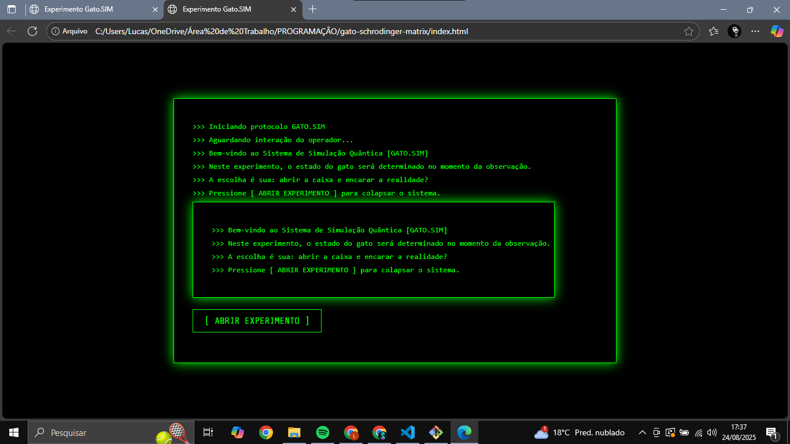

# 🧪 Experimento do Gato de Schrödinger — Estilo Matrix

Simulação interativa inspirada no paradoxo quântico de Schrödinger, com uma interface visual baseada na estética da trilogia *Matrix*.

### 🔮 Demonstração

> **Acesse o projeto ao vivo**: [https://createdByLucas182.github.io/gato-schrodinger-matrix/](https://createdByLucas182.github.io/gato-schrodinger-matrix/)

### 🧱 Tecnologias Utilizadas

- **HTML5** → Estrutura básica do projeto  
- **CSS3** → Estilo visual inspirado na estética Matrix  
- **JavaScript** → Lógica interativa do experimento  
- **Git & GitHub** → Controle de versão e hospedagem

### 📦 Estrutura do Projeto

gato-schrodinger-matrix/
├── index.html
├── style.css
├── script.js
├── assets/
│ ├── background.jpg
│ ├── sound.mp3
│ └── screenshot.png
└── README.md

### ⚙️ Funcionalidades

- Caixa interativa que simula o experimento do Gato de Schrödinger  
- Resposta randômica: **vivo** ou **morto** ao abrir a caixa  
- Efeitos visuais de fundo no estilo Matrix  
- Design responsivo para diferentes telas

### 🎯 Objetivo do Projeto

Este projeto foi desenvolvido como estudo prático de:

- Lógica condicional com JavaScript  
- Manipulação de DOM  
- Estilização avançada com CSS  
- Versionamento de código com Git e GitHub  
- Organização e documentação de projeto

### 🛠️ Como Executar Localmente

1. Clone o repositório:  
   ```bash
   git clone https://github.com/createdByLucas182/gato-schrodinger-matrix.git

### 📸 Captura de Tela



